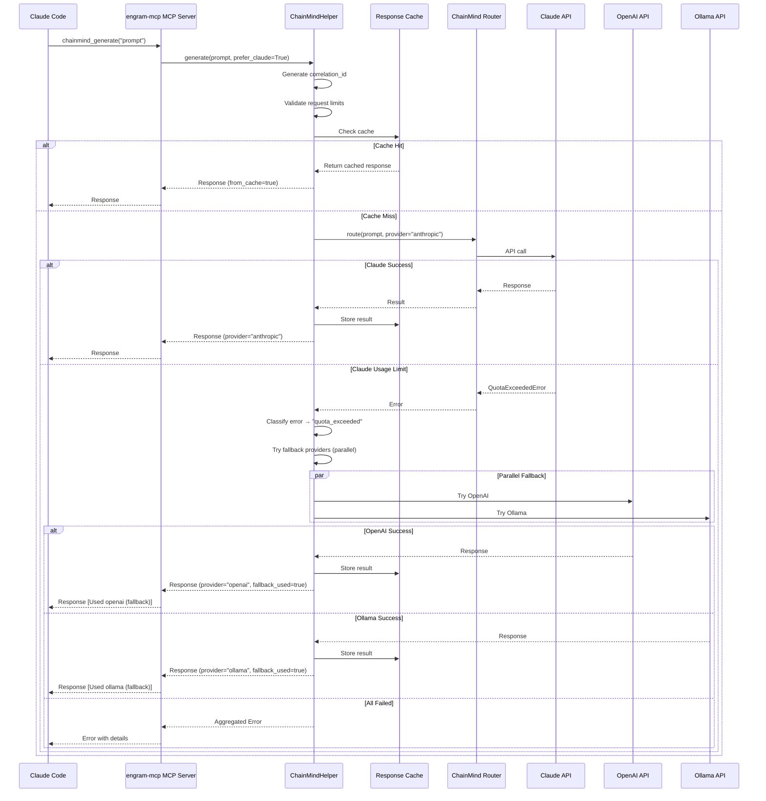
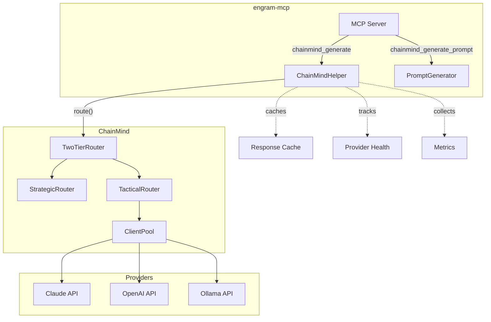
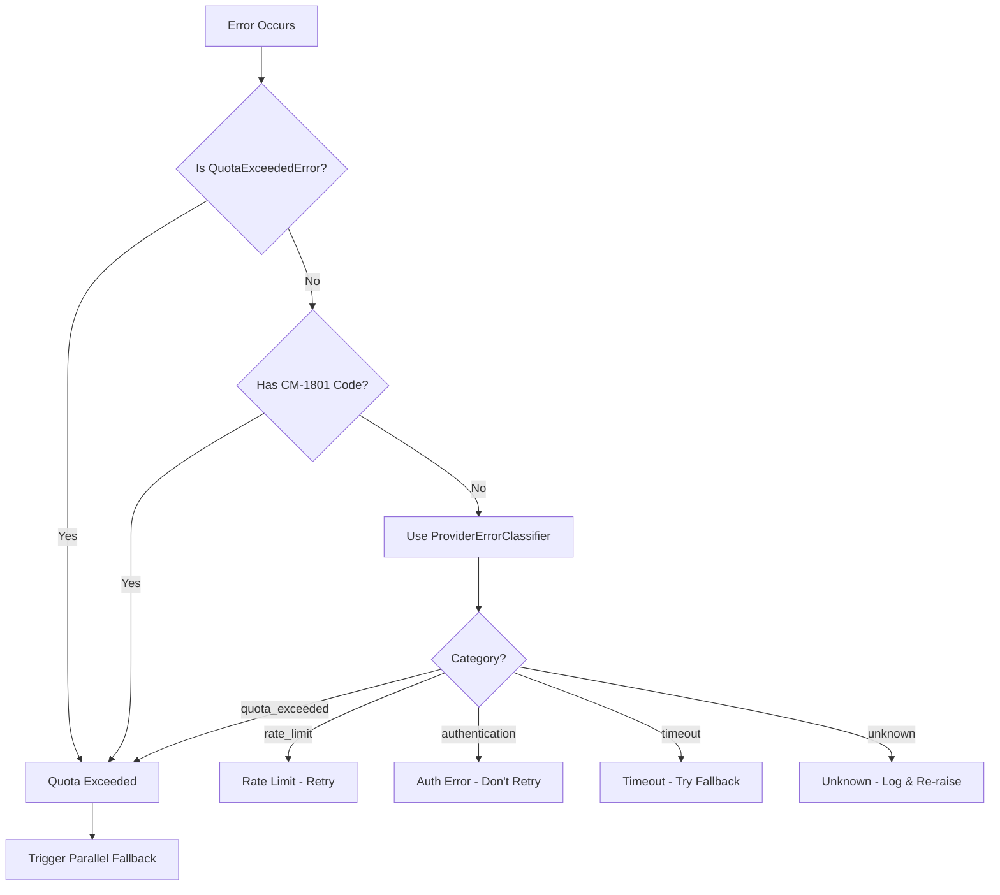
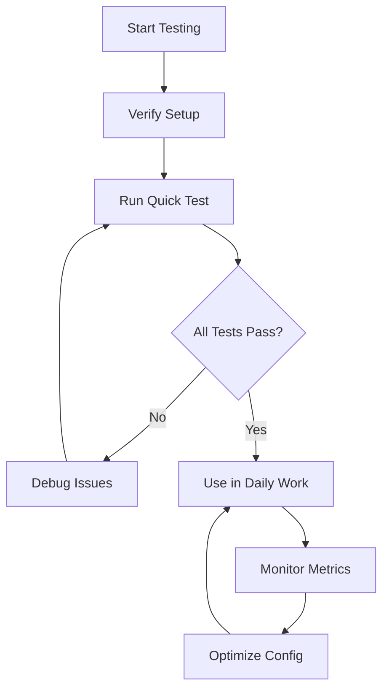

# Visual Guide: How ChainMind Integration Works

## Request Flow Diagram



## Component Interaction



## Error Detection Flow



## Parallel Fallback Comparison

### Sequential (Old Way)
```
Time: 0s ────────────────────────────────────────────────> 9s
      │
      ├─ Try Claude (3s) ──X──> Fail
      │
      ├─ Try OpenAI (3s) ──X──> Fail
      │
      └─ Try Ollama (3s) ──✓──> Success

Total: 9 seconds
```

### Parallel (New Way)
```
Time: 0s ────────────────────────────────> 3s
      │
      ├─ Try Claude ──X──> Fail
      │
      ├─ Try OpenAI ──┐
      │                ├─> First Success Wins
      └─ Try Ollama ───┘

Total: 3 seconds (3x faster!)
```

## Benefits Visualization

### Cost Savings
```
Without Caching:
Request 1: $0.01 ──┐
Request 2: $0.01 ──┼─> Total: $0.05
Request 3: $0.01 ──┤
Request 4: $0.01 ──┤
Request 5: $0.01 ──┘

With Caching (50% hit rate):
Request 1: $0.01 ──┐
Request 2: $0.00 ──┼─> Total: $0.03
Request 3: $0.01 ──┤   Savings: 40%
Request 4: $0.00 ──┤
Request 5: $0.01 ──┘
```

### Reliability Improvement
```
Without Circuit Breaker:
Provider Fails → Try Again → Fail → Try Again → Fail → Try Again → Fail
(4 attempts, 12 seconds wasted)

With Circuit Breaker:
Provider Fails → Mark Unhealthy → Skip Immediately → Try Next Provider
(1 attempt, 3 seconds, instant skip)
```

## Testing Flow



## Real-World Example

### Scenario: Daily Coding Session

**Morning** (9:00 AM):
```
You: "Write a function to parse JSON"
ChainMind: Uses Claude → Cached
Time: 1.2s
```

**Afternoon** (2:00 PM):
```
You: "Write a function to parse JSON" (same question)
ChainMind: Cache Hit!
Time: 0.01s (instant!)
```

**Evening** (8:00 PM):
```
You: "Write a function to parse JSON" (again)
ChainMind: Cache Hit!
Time: 0.01s
```

**Next Day** (9:00 AM):
```
You: "Write a function to parse JSON"
ChainMind: Claude hits usage limit
         → Automatically uses OpenAI
         → Returns response
         → You don't notice the switch!
Time: 2.5s (slightly slower, but works!)
```

**Benefits**:
- Day 1: 3 requests, 1 API call (2 cache hits)
- Day 2: Automatic fallback, no interruption
- Total savings: 66% fewer API calls, seamless experience
